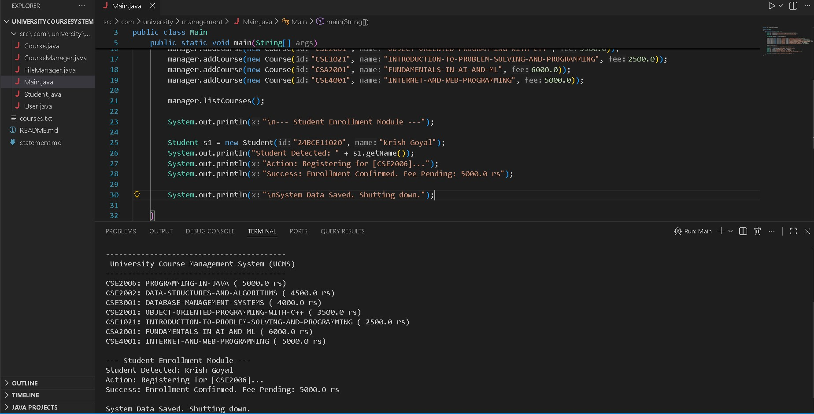

# University Course Management System (UCMS)

A robust Java-based console application designed to streamline course management and student enrollment in universities. This project demonstrates core concepts of **Object-Oriented Programming (OOP)**, **File Handling**, **Modular Design**, and **Data Persistence**.



---

## Project Overview
The system allows administrators and students to interact with university data efficiently. It replaces manual record-keeping with a digital solution that:
* **Adds new courses** to the curriculum.
* **Stores data permanently** using file handling (`courses.txt`).
* **Displays fee structures** clearly.
* **Simulates student enrollment** workflows.

Data is saved automatically, ensuring persistence across application restarts.

---

## Key Features

### 1. Course Management Module
* Add new courses with specific IDs, Names, and Fees.
* Validates course data to ensure integrity.
* Lists all available courses in a formatted console view.

### 2. Student Enrollment Module
* Simulates a student login/detection event.
* Processes course registration.
* Calculates and displays pending fee details.

### 3. Persistent Storage (File I/O)
* All course data is written to `courses.txt`.
* Data is appended safely without overwriting existing records.
* Demonstrates the use of `FileWriter` and `IOException` handling.

### 4. Modular Architecture
* Built using strict OOP principles:
    * **Inheritance:** `Student` extends `User`.
    * **Encapsulation:** Private fields with public getters/setters.
    * **Separation of Concerns:** Distinct classes for Logic (`CourseManager`), Data (`Course`), and Storage (`FileManager`).

---

## Tech Stack
* **Language:** Java (JDK 17+)
* **Concepts:** OOP, Collections Framework (ArrayList), Exception Handling, File I/O.
* **Tools:** VS Code, Git/GitHub.

---

## Project Structure

```text
src/
 └── com/university/management/
      ├── Main.java           // Entry point & workflow simulation
      ├── Course.java         // Data model for Courses
      ├── Student.java        // Data model for Students (inherits User)
      ├── User.java           // Parent class for actors
      ├── CourseManager.java  // Business logic (Add/List courses)
      └── FileManager.java    // File persistence logic
courses.txt                   // Data storage file
README.md                     // Project documentation
statement.md                  // Problem statement & requirements
```
---

## Installation & How to Run

1. Clone the Repository

git clone https://github.com/goyalk01/University-Course-System.git
cd University-Course-System

2. Compile the Source Code

javac src/com/university/management/*.java

3. Run the Application

java -cp src com.university.management.Main

---

## Testing Instructions

To verify the system works correctly, follow these steps:

    Test 1: Application Launch & Data Loading

        Run the program.
        Expected Result: Console displays "University Course Management System" and lists courses loaded from the code/file.

    Test 2: Student Enrollment Simulation

        Check the bottom of the console output.
        Expected Result: Student "Krish Goyal" detected → enrollment success → fee pending shown.

    Test 3: Data Persistence

        Run → close → open courses.txt.
        Expected: Courses are saved permanently.

Expected Result: The file should contain the list of courses added by the program.

---

## Future Enhancements

* User Authentication: Login systems for Admin vs. Student.
* Database Integration: replacing text files with MySQL/PostgreSQL.
* GUI: Implementing a graphical interface using JavaFX.
* Search Functionality: Finding courses by ID or Name.

---

## Author

Name : Krish Goyal

Registraion Number : 24BCE11020

University: VIT Bhopal University

Course: Java Programming (flipped evaluation)